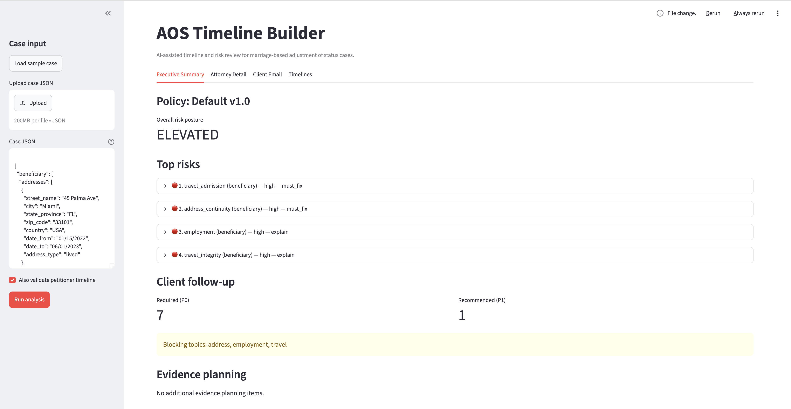
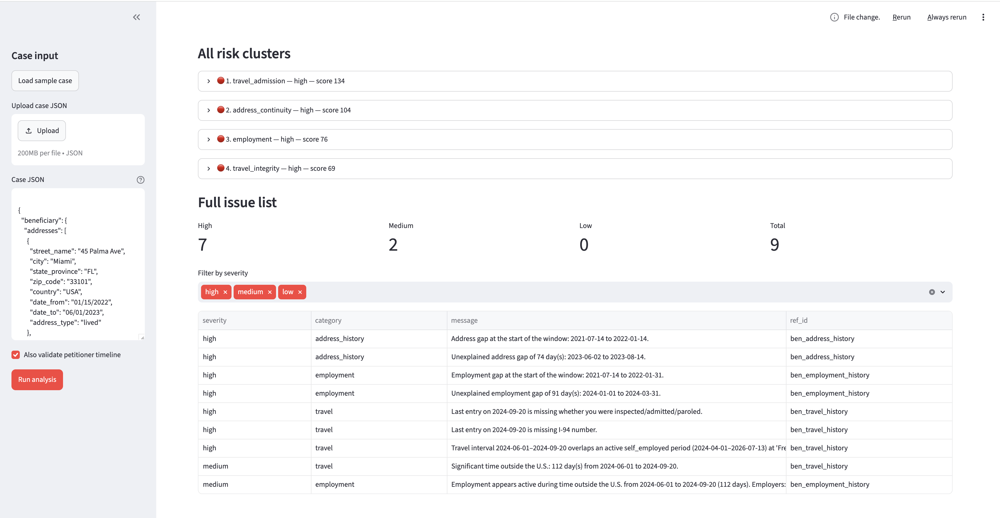
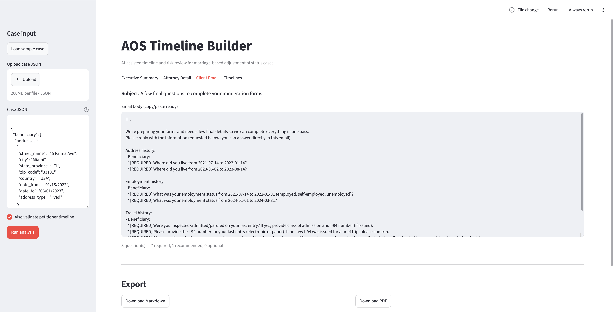

# AOS Timeline Builder

AI-assisted timeline and risk review for marriage-based adjustment of status (AOS) cases.

You give it a case's address, employment, and travel history (petitioner and beneficiary), and it flags the same kinds of continuity problems an experienced immigration paralegal checks for by hand — before USCIS finds them.

## Motivation

From a client's perspective, the immigration process appears straightforward: complete the required forms, submit supporting documentation, and rely on the attorney's office to manage the rest. Less visible is what happens afterward — a process that typically costs several thousand dollars and takes weeks before a paralegal has fully assembled the case.

Some of that cost reflects legal representation, which is reasonably expected. A significant portion of the timeline, however, is consumed by paralegals manually cross-referencing years of address, employment, and travel history to identify the same gaps and inconsistencies USCIS will ultimately flag. This is fundamentally a data-processing task rather than a legal one: repetitive, rule-based, and better suited to automation than to hours of manual review. There is little reason this step should take weeks rather than minutes, with attorney and paralegal time better spent on judgment calls the case actually requires.

This project addresses that gap: it replaces manual case-building with a tool a paralegal can run in minutes, so their expertise is directed toward the parts of a case that genuinely require it.

Marriage-based adjustment of status was chosen as the starting point because it is one of the most common paths to permanent residency and requires exactly this kind of multi-category timeline documentation. The underlying approach, however, is not specific to it: parsing raw case history into typed timelines, validating continuity against a lookback window, and surfacing prioritized findings is a pattern that applies to other case types with comparable documentation requirements, with the case-specific rules isolated to their own modules (see `src/`). Marriage-based AOS serves as the initial, fully worked example.

## Why timeline consistency matters

Marriage-based AOS cases require documenting years of address, employment, and travel history for both spouses — this tool defaults to a 5-year lookback window, a common requirement. A window that long is precisely what makes gaps so easy to end up with, even for entirely legitimate cases: people move without a forwarding address on file, freelance between formal jobs, or simply don't remember exact dates years later. The gaps aren't evidence of wrongdoing, but USCIS reviews that history for continuity regardless, and unexplained gaps or inconsistencies are exactly what raises questions:

- **Unexplained address gaps** — periods where the beneficiary's whereabouts aren't accounted for.
- **No joint residency evidence** — if the couple can't show they actually lived together, that undercuts the core premise of a marriage-based petition.
- **Undocumented or unmatched travel** — international trips missing entry/exit pairing, or a most-recent entry with no record of inspection/admission, which is foundational to AOS eligibility.
- **Long, unexplained separations near the marriage date** — periods apart that a client may not think to mention but that an officer will ask about.

None of this is exotic — it's what an attorney or paralegal already checks for. The problem is that checking it by hand means manually cross-referencing every address, job, and trip against every other one, for both spouses, across a multi-year window. It's tedious, easy to miss something in, and the cost of missing something isn't a typo — it's a Request for Evidence, months of delay, or added scrutiny in the interview.

This tool automates that cross-referencing. It doesn't just organize the timeline — it applies the same red-flag checks an attorney would, scores each finding by severity and urgency, and turns the result into two things a firm can act on immediately: a risk summary for the attorney, and a ready-to-send email asking the client for exactly what's missing.

**This is a QC/screening aid, not a legal determination.** Every packet it generates carries the same disclaimer: *"Draft QC output. Attorney review required."* It surfaces things worth a second look — it doesn't decide what's fine and what isn't. That judgment stays with a licensed attorney.

## What it does

- **Address & employment continuity** — detects gaps and overlaps against the required lookback window (default: last 5 years), aware of partial-date precision (year/month/day) so it doesn't manufacture false gaps from incomplete dates.
- **Joint residency detection** — finds the earliest point the petitioner and beneficiary's addresses overlap, and flags it if there's no shared-residence evidence at all.
- **Travel & admission risk** — pairs entries/exits, flags missing I-94 or inspection data on the most recent entry (the field most likely to matter for AOS eligibility), and flags extended absences.
- **Employment authorization & marriage-timeline intelligence** — flags employment overlapping a long absence, and separation patterns around the marriage date specifically.
- **Risk scoring & prioritization** — every finding is clustered into a topic, scored, and given a resolution type (`must_fix`, `explain`, `prepare_evidence`) so the attorney knows what's urgent versus what just needs a client explanation.
- **Client clarification email** — a deduplicated, prioritized (P0/P1/P2), copy/paste-ready email asking the client for exactly the missing information.
- **Executive summary + exports** — a lawyer-first summary page, exportable as Markdown or PDF, plus the full structured packet as JSON.
- **Configurable firm policy** — risk thresholds, how many top risks to surface, and wording are all adjustable via a policy file rather than hardcoded.

## How to use it

Two ways to enter a case in the app:

- **Build a case** (default) — a guided form with add/remove rows for addresses, jobs, and trips. No JSON knowledge required; this is the intended path for paralegals and non-technical staff.
- **Paste JSON** — for testing, or for reusing a saved case file. Includes a "Load sample case" button.

## Screenshots

**Executive summary** — the lawyer-first view: overall risk posture, top findings, and what still needs client follow-up.



**Attorney detail** — every risk cluster with its full narrative, plus the complete filterable issue list.



**Client email** — a deduplicated, prioritized, copy/paste-ready request for the missing information.



## Data handling & security

Worth being upfront about, since this is the actual adoption question for a firm — not whether the UI is easy to use.

**Current state:** the app runs entirely locally in a single Streamlit session. There's no database, no external API calls, and no analytics or telemetry. Case data lives only in memory for the duration of the session; the one file written to disk is a temporary PDF during export, which is deleted immediately after it's read. Nothing persists once the session ends.

**What this is not:** production-ready for handling real client PII (names, A-numbers, addresses) across a firm. There's no authentication, no access control, no audit logging, and no encryption at rest — because right now there's nothing at rest to encrypt. A real deployment would need all of that, plus a decision about where it's hosted (a public Streamlit Cloud instance is not an appropriate place to run this with real case data).

Being honest about that gap now, rather than after someone points it out, is deliberate — security is the harder problem here, not the interface.

## Roadmap

- **Import from existing case management platforms.** Most firms already run a secure case management system (many expose case data as JSON via an API). Building an import path against those systems — instead of asking staff to re-enter data by hand — would likely do more for both adoption and security than anything built from scratch here, since it keeps data inside infrastructure the firm already trusts.
- Firm policy configuration through the UI, instead of a config file.
- Support for additional case types beyond marriage-based AOS.
- Persistent, access-controlled case storage, if this ever moves beyond single-session local use.

## Project structure

```
src/
  models.py      - typed case data (pydantic): people, addresses, employment, travel
  glue.py        - parses raw input into typed entries, tracks provenance
  normalize.py   - flexible date parsing (MM/DD/YYYY, MM/YYYY, "Present", etc.)
  validate.py    - core gap/overlap detection
  joint_residency.py, travel_intelligence.py,
  employment_intelligence.py, marriage_intelligence.py
                 - the specific risk-detection modules
  pipeline.py    - orchestrates parsing + validation into a BuildResult
  packet.py      - turns issues into a scored, prioritized attorney review packet,
                   the executive summary, and the client clarification email
  policy.py      - firm-level configuration (thresholds, wording)
  exporters.py   - Markdown / PDF rendering of the packet
app.py           - Streamlit UI
```

33 automated tests cover the validation and packet-building logic (`src/test_*.py`).

## Getting started

```bash
git clone git@github.com:alexavelez/aos-timeline-builder.git
cd aos-timeline-builder
python3 -m venv venv
source venv/bin/activate
pip install -r requirements.txt
streamlit run app.py
```

## Running tests

```bash
source venv/bin/activate
pip install pytest
pytest src/ -q
```
